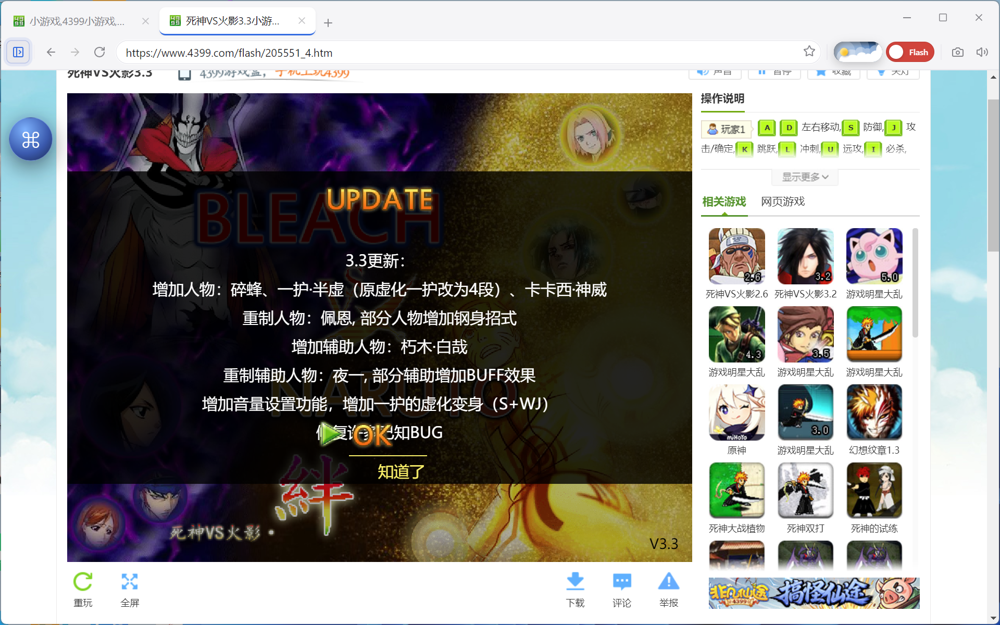
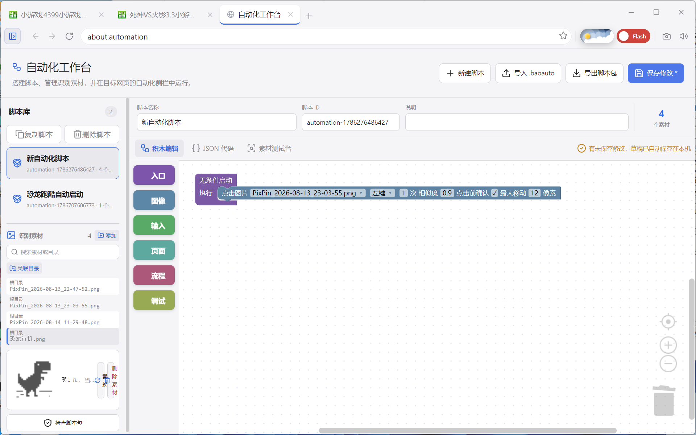
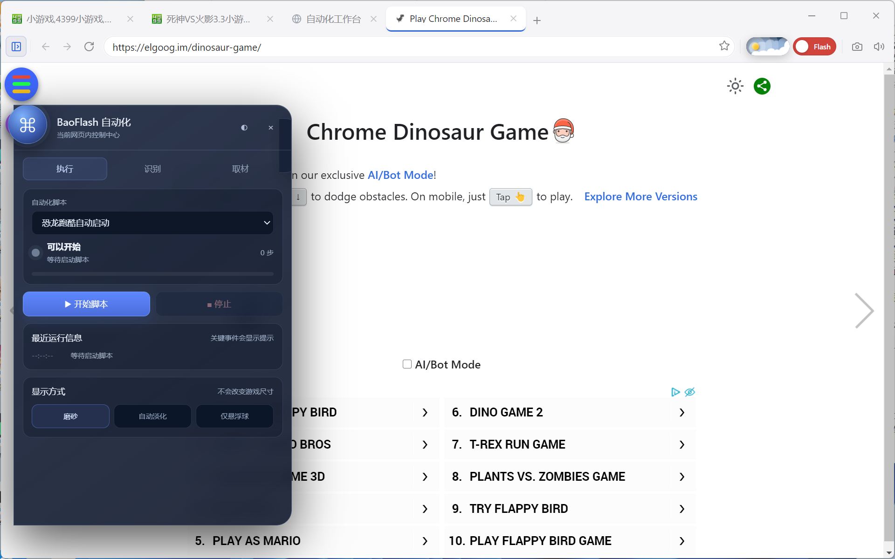
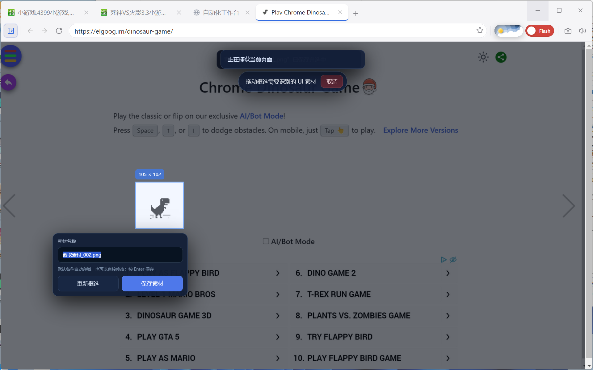
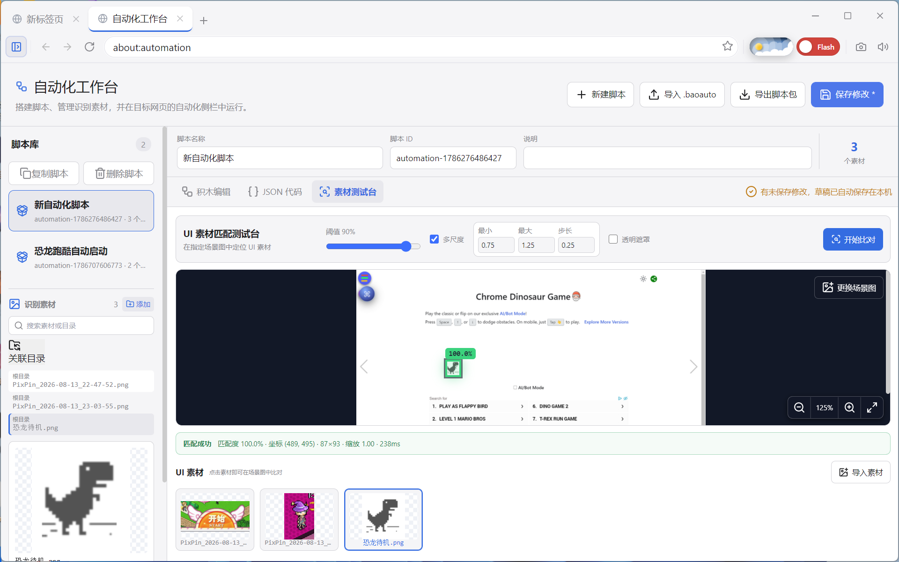

# BaoFlashBrowser

> Keep legacy Flash games running—and automate them with image recognition and visual workflows.

[中文](README.md) **|** [English](README_EN.md)

[](https://github.com/Sutanm/BaoFlashBrowser/actions/workflows/ci.yml)
[](https://www.electronjs.org/)
[](#platform-support)
[](LICENSE)

BaoFlashBrowser is more than a Flash browser. It brings together a **native PPAPI/Ruffle dual-engine runtime**, a **visual automation workbench**, and a **userscript platform**. It keeps legacy Flash content usable on modern systems while allowing web and game UI to be automated through image assets, Blockly workflows, and trusted input.

> **Automation does not need to occupy your desktop: after the window is minimized, workflows can keep capturing frames, recognizing UI, and sending mouse or keyboard input to the BrowserView.**



<p align="center"><sub>Keep playing classic Flash games on modern Windows systems</sub></p>

## Automation Platform at a Glance

### Build scripts like connecting blocks



Combine Entry, Image, Input, Page, Flow, and Debug blocks while managing image assets, scripts, and editable JSON in one workbench.

### Capture and control without leaving the game

<table>
  <tr>
    <td width="50%"></td>
    <td width="50%"></td>
  </tr>
  <tr>
    <td align="center">Floating assistant: select, check, start, stop, and follow a workflow</td>
    <td align="center">Region capture: freeze the page and save a single UI asset directly</td>
  </tr>
</table>

### Verify recognition before running a workflow



The asset test bench reports the match score and highlights the best hit in the full scene, making it easy to refine an asset or threshold before execution.

After verification, minimize the browser and let the workflow continue. Targets are located again from the current frame instead of relying on desktop coordinates recorded earlier.

## Why BaoFlashBrowser

### Dual Flash engines and legacy-site compatibility

- Electron is intentionally fixed at 11.5.0 / Chromium 87, the final Chromium generation with native PPAPI Flash support.
- Each tab can independently use PPAPI or Ruffle. Ruffle supports bundled resources and a CDN fallback.
- Compatibility handling covers Flash version gates, SWFObject, cross-origin resources, and login redirects on sites such as Taomee, 4399, and 7k7k.
- Every tab runs in an independent BrowserView renderer, so one crashed game does not blank the entire browser.

### Visual automation without fixed desktop coordinates

- BrowserView captures and OpenCV template matching locate UI at runtime instead of replaying recorded screen coordinates.
- BrowserView rendering remains active while the application is minimized, allowing capture, matching, and trusted mouse or keyboard input to continue.
- Workflows support unconditional and image-ready entry points, waits, image clicks, pointer movement, key combinations, hold-until actions, text input, scrolling, navigation, and reloads.
- Flow control includes `if / else`, `all / any / not` conditions, fixed-count loops, and loops that run until a condition becomes true.
- Optional pre-click verification and movement limits reduce accidental clicks caused by animation or an unstable match.

### A Blockly workbench for non-programmers

- Build scripts in `about:automation` from Entry, Image, Input, Page, Flow, and Debug blocks.
- The same workflow can be edited as JSON, with validation and conversion in both directions.
- Portable `.baoauto` packages contain both the validated workflow and its image assets, and can be imported, exported, copied, checked, and shared.
- The asset test bench compares UI assets against a selected scene image, reports the score, and highlights the best matching region.

### An in-page floating assistant

- A floating orb opens controls for script selection, readiness checks, countdown or immediate start, cancellation, progress, and logs.
- Capture a single UI asset directly from a frozen game frame without using third-party screenshot software.
- Adjust thresholds, capture and compare, or continuously monitor a target from inside the page.
- The assistant briefly hides only while a capture is taken, then immediately returns. It can also collapse, move to the opposite edge, or fade automatically.

### A complete userscript platform

- Tampermonkey-style management, two-phase installation, enable/disable, updates, import/export, and menu commands.
- Controlled GM APIs, `@require`, value storage, network requests, downloads, notifications, and iframe sub-frame execution.
- A bundled CSS fixer improves some modern-page styling that Chromium 87 cannot render correctly by itself.
- Userscripts never receive direct Node.js, arbitrary Electron IPC, or local-filesystem access.

## How automation works

| Stage | User action | Platform behavior |
| --- | --- | --- |
| 1. Capture | Select a button, icon, or label in the game frame | Save it as an image asset in the current script |
| 2. Verify | Test the asset in the workbench or floating assistant | Calculate a score and highlight the actual hit region |
| 3. Build | Connect entry, image, input, and flow blocks | Produce a schema-validated workflow |
| 4. Ready | Start the script and wait for prerequisites | Report ready only after the target page is recognized |
| 5. Execute | Start immediately or after a countdown | Relocate the target and send trusted BrowserView input |

This makes it possible to express “click only when the login button is visible,” “wait for loading to finish before pressing a key combination,” or “repeat until one of several images appears”—not just a recorded sequence of delays and coordinates.

## Typical use cases

- Reusable flows for game login, collection, confirmation, and navigation.
- Waiting for a loading marker to appear or disappear instead of relying on fragile fixed delays.
- Holding a direction key until a target frame appears, with alternative branches for different states.
- Continuing unattended repetitive work while the browser is minimized.
- Using a userscript to repair the page shell and visual automation to control Flash content that has no accessible DOM elements.

Image automation does not understand business intent. Keep human confirmation for accounts, payments, deletion, and other irreversible actions.

## Quick start

1. Open Automation from the sidebar, or navigate directly to `about:automation`.
2. Create a script and import image assets, or capture UI directly from the target game with the floating assistant.
3. Add one entry block and connect image, input, branch, or loop blocks below it.
4. Save the workflow and verify its highlighted target and score in the asset test bench.
5. Return to the game, select the script in the floating assistant, and start it.

For animated targets, capture only a stable region. See the [Automation User Guide](docs/automation-user-guide.md) for the full workflow.

## Enable Experimental Flash

The experimental channel selects Flash plugins that have not been fully validated; it is not a global developer mode.

1. Open **Settings** from the sidebar.
2. Enter **Flash / Ruffle**.
3. Change **Flash plugin channel** to **Experimental channel**.
4. Select **Save settings** at the bottom.
5. Fully quit and restart BaoFlashBrowser. Reloading the page or closing a tab is not sufficient.

| Platform | Behavior after enabling it |
| --- | --- |
| Windows x64 | Uses the bundled China-modified PPAPI Flash `34.0.0.380` |
| Experimental macOS Intel x64 package | Uses the `PepperFlashPlayer.plugin` `34.0.0.380` integrated into the `.app` |
| Windows ia32 / Linux x64 | No matching experimental plugin exists yet, so the request falls back to the stable plugin |

The spoofed version is the version reported to websites and is separate from the physical plugin version; its default can be left unchanged. Experimental plugins may cause component errors, debugger dialogs, crashes, or startup failures. The macOS build has never been tested on real hardware. Switching back to Stable also requires saving and restarting.

## Downloads

- [GitHub Releases](https://github.com/Sutanm/BaoFlashBrowser/releases)
- [Gitee Releases](https://gitee.com/sutanm/BaoFlashBrowser/releases)
- [v1.1.1 Experimental Flash/macOS Support](docs/experimental-platform-support.md)
- [v1.1.1 Release Notes](RELEASE_NOTES.md)

The Windows installers are currently **unsigned**. Microsoft Defender SmartScreen may display an “Unknown publisher” warning during installation or first launch. Download only from the project release pages and verify the published SHA-256 checksum, or run the current version from source as described below.

## Platform Support

| Platform | Status | Notes |
| --- | --- | --- |
| Windows x64 | Primary | Recommended; includes PPAPI, aria2, and the mouse-wheel zoom hook |
| Windows ia32 | Not fully tested | Includes matching 32-bit PPAPI and aria2 binaries |
| Linux x64 | Limited | Running from source is recommended; AppImage behavior varies with FUSE, shared libraries, and X11/Wayland |
| macOS Intel x64 | Experimental, zero testing | Integrates PPAPI Flash 34.0.0.380; no Mac hardware testing. Apple Silicon can only attempt Rosetta 2 |
| Linux x86 | Unsupported | No complete PPAPI and native-resource support chain |

## Run from Source

Node.js 20 and npm are required. Electron is fixed at `11.5.0` and must not be upgraded.

```bash
git clone https://github.com/Sutanm/BaoFlashBrowser.git
cd BaoFlashBrowser
npm ci
npm start
```

### Linux dependencies

On Ubuntu/Debian, install the graphical, audio, and system libraries required by Electron 11:

```bash
sudo apt install -y libnss3 libgtk-3-0 libx11-xcb1 libxtst6 libxss1 \
  libasound2 libdrm2 libgbm1 libxkbcommon0 libpango-1.0-0 libcairo2 \
  libatk1.0-0 libatk-bridge2.0-0 libcups2 libxcomposite1 libxdamage1 \
  libxfixes3 libxrandr2 libxrender1 libxi6 libnotify4 libsecret-1-0 \
  libpulse0 libdbus-1-3 libaria2-0
```

The bundled Linux `aria2c` requires `libaria2.so.0`. If it is unavailable, the application tries a system `aria2c` and then falls back to Chromium downloads. The mouse-wheel zoom hook may not work under native Wayland; X11, XWayland, and WSLg are more reliable.

## Build and Verification

```bash
npm run check       # i18n, type checks, lint, unit tests, and production build
npm run build:win64 # Windows x64 NSIS
npm run build:win32 # Windows ia32 NSIS (not fully tested)
npm run build:linux # Linux x64 AppImage; run on Linux/WSL
npm run build:mac   # Experimental macOS Intel x64 DMG/ZIP; must run on macOS and has never been tested
```

`build:mac` verifies the experimental Flash DMG checksum, extracts the complete plugin in a temporary directory, and bundles the decoded `PepperFlashPlayer.plugin` directly into the `.app`. The source DMG is not included in the final package. The **Package experimental macOS build** GitHub Actions workflow can also be started manually to produce the DMG/ZIP.

Release scripts validate Ruffle, fonts, PPAPI, aria2, mouse hooks, and target architectures. Manifests are written to `release/manifests/`. A successful macOS package build proves only that its resources and package structure passed validation; it does not prove that Flash works on real Mac hardware.

## Browser Essentials

- Tab management, navigation, zoom, mute, fullscreen, find-in-page, history, and bookmarks.
- Chromium and aria2 download engines with pause, resume, progress reporting, and path-safety checks.
- Optional password capture, locked-vault autofill, excluded sites, and master-password protection. Autofill never submits a form.
- Session recovery is offered only after an abnormal exit; normal shutdown leaves no recoverable session.
- Chinese and English UI, light and dark themes, Toast notifications, and optional inactive-tab suspension.

## Common Shortcuts

| Shortcut | Action |
| --- | --- |
| `Ctrl+T` / `Ctrl+W` | New / close tab |
| `Ctrl+L` | Focus the address bar |
| `Ctrl+Tab` | Switch tabs |
| `Ctrl++` / `Ctrl+-` / `Ctrl+0` | Page zoom |
| `Ctrl+F` | Find in page |
| `F11` / `F12` | Fullscreen / developer tools |

## Security and Limitations

Electron 11, Chromium 87, and Adobe Flash Player no longer receive security updates. Use this application only for trusted legacy game sites and local content. Do not use it for email, payments, cloud storage, business systems, or other sensitive activity. Prefer Ruffle whenever it can run the content correctly.

The Windows stable channel uses Flash 29.0.0.171, the Windows x64 experimental channel and experimental macOS package use 34.0.0.380, and Linux uses 32.0.0.371. The version reported to websites may differ for legacy-site compatibility. Flash Player is proprietary software; users are responsible for understanding applicable licensing and distribution requirements in their jurisdiction.

## Documentation

- [Zero-Experience Automation Blockly Guide](docs/automation-blockly-beginner-guide.md) (Chinese; no programming knowledge required)
- [Documentation Index and Currency Notes](docs/README.md) (Chinese)
- [Automation User Guide](docs/automation-user-guide.md) (Chinese)
- [Userscript User Guide](docs/userscript-user-guide.md)
- [Userscript Developer Guide](docs/userscript-developer-guide.md)
- [Architecture and Module Manual](docs/architecture-manual.md)
- [Packaging and Release Verification](docs/PACKAGE.md)
- [Test and Regression Checklist](docs/FINAL_REGRESSION.md)
- [Troubleshooting and Lessons Learned](docs/lessons-learned.md)
- [Third-Party Notices](THIRD_PARTY_NOTICES.md)

## License

BaoFlashBrowser source code is licensed under the [MIT License](LICENSE). Flash Player, Ruffle, aria2, OpenCV, Blockly, fonts, and other bundled third-party components retain their respective licenses and rights; see [THIRD_PARTY_NOTICES.md](THIRD_PARTY_NOTICES.md).
